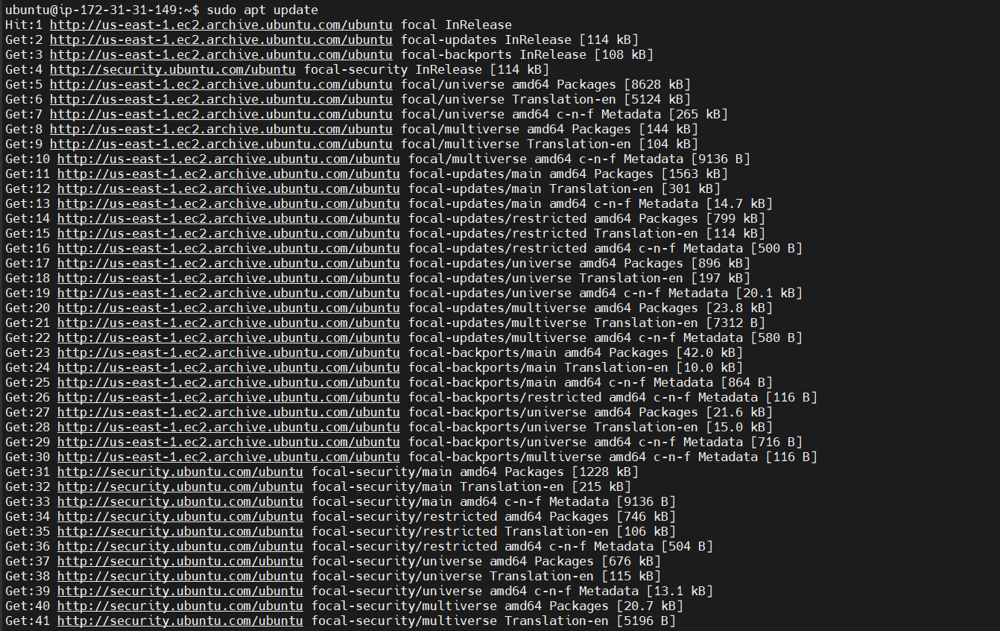
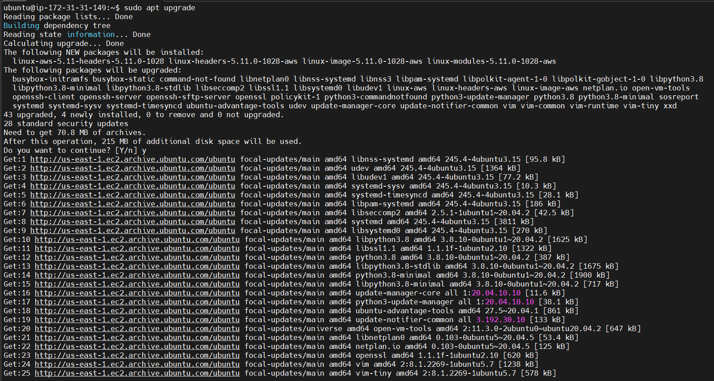
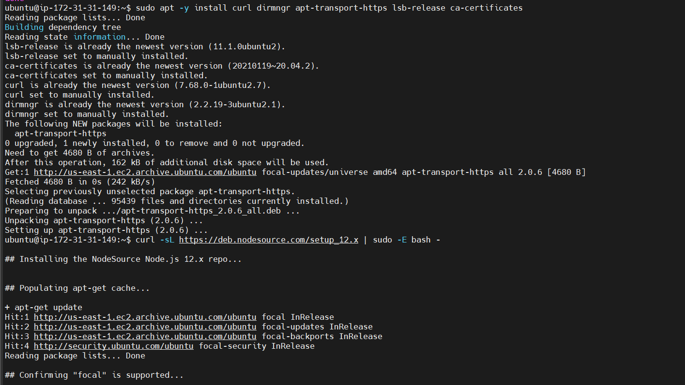
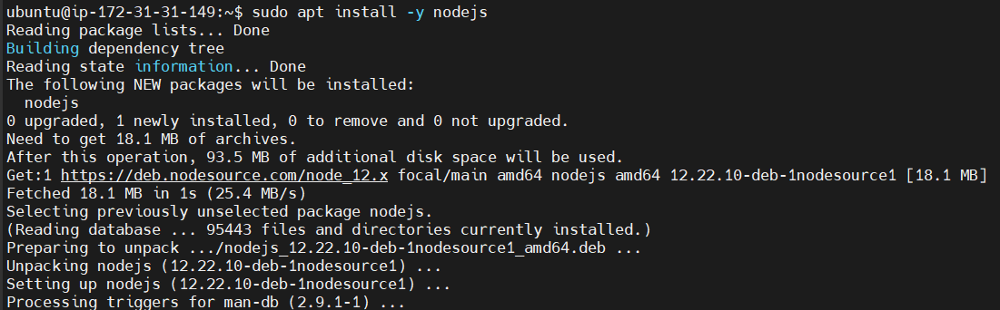

# Project 4

**Backend Configuration**
___

updating ubuntu

` $ sudo apt update`

upgrading ubuntu

`$ sudo apt upgrade`

adding certificates

`$ sudo apt -y install curl dirmngr apt-transport-https lsb-release ca-certificates`

`$ curl -sL https://deb.nodesource.com/setup_12.x | sudo -E bash -`

installing nodejs

`$ sudo apt install -y nodejs`

