# Project 4

**Backend Configuration**
___

updating ubuntu

` $ sudo apt update`

upgrading ubuntu

`$ sudo apt upgrade`

adding certificates

`$ sudo apt -y install curl dirmngr apt-transport-https lsb-release ca-certificates`

`$ curl -sL https://deb.nodesource.com/setup_12.x | sudo -E bash -`

**installing nodejs**

`$ sudo apt install -y nodejs`

**installing mongodb**

` $ sudo apt-key adv --keyserver hkp://keyserver.ubuntu.com:80 --recv 0C49F3730359A14518585931BC711F9BA15703C6`

` $ echo "deb [ arch=amd64 ] https://repo.mongodb.org/apt/ubuntu trusty/mongodb-org/3.4 multiverse" | sudo tee /etc/apt/sources.list.d/mongodb-org-3.4.list`

` $ sudo apt install -y mongodb`

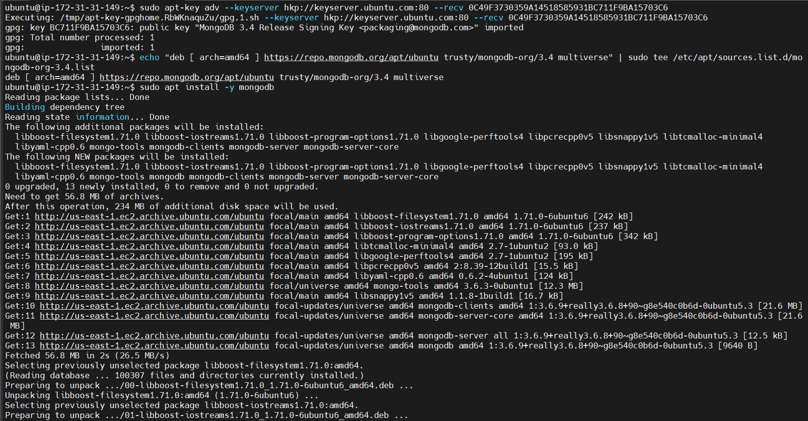

starting the server

` $ sudo service mongodb start`

` $ sudo systemctl status mongodb`

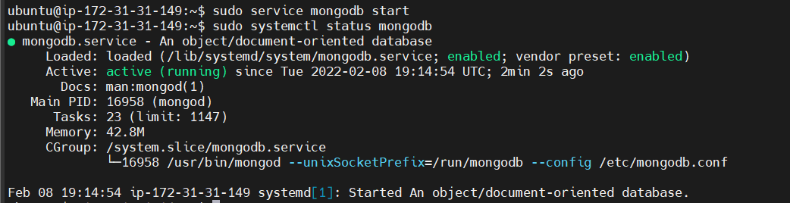

installing aptitude to download npm

` $ sudo apt install aptitude`

` $ sudo aptitude install npm`

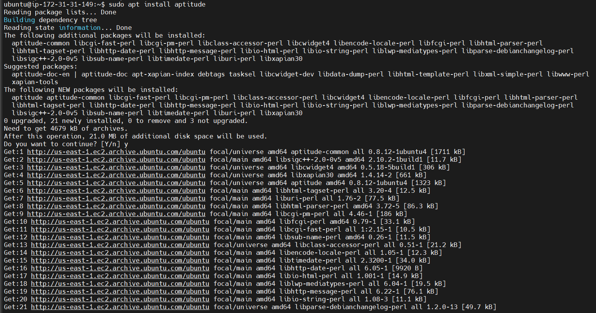

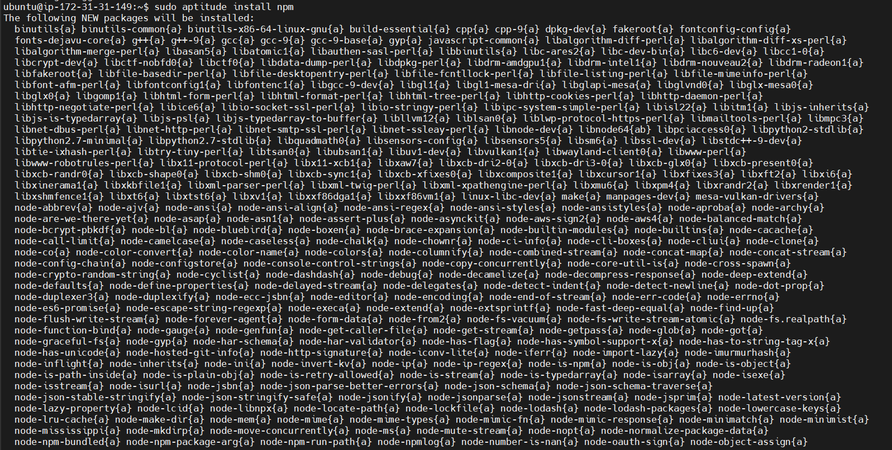

installing body-parser package to help process json files passed in requests to the server

` $ sudo npm install body-parser`

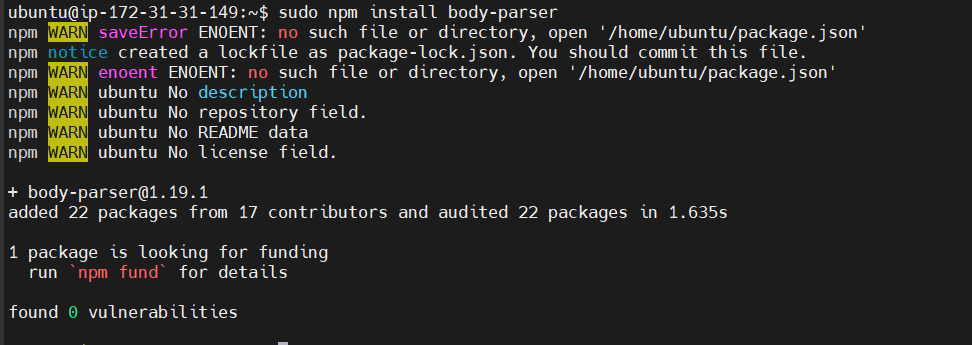

creating and entering the books directory

` $ mkdir books && cd books`

initializing npm project

` $ npm init`

creating and adding the server.js file to the directory

`vi server.js`

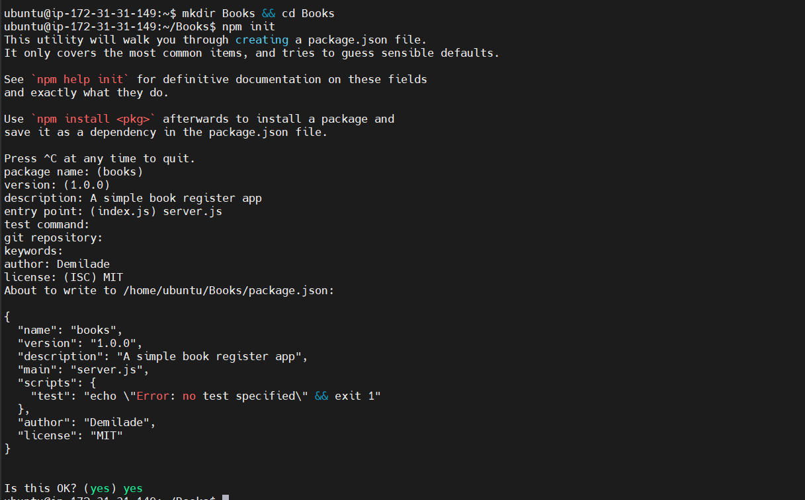

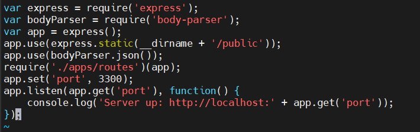

**installing express and setting up the routes to the server**

installing mongoose and express

` $ sudo npm install express mongoose`

creating and entering the apps folder from the books folder

` $ mkdir apps && cd apps`

creating the routes.js file

` $ vi routes.js`

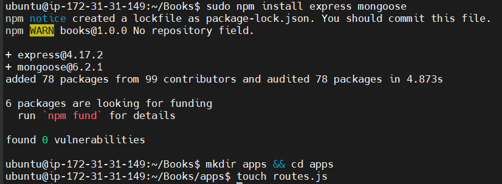

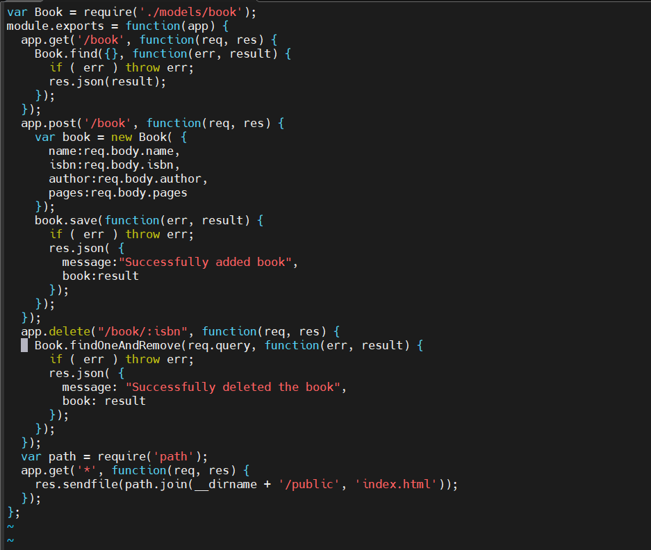

creating the models folder from the apps directory

` $ mkdir models && cd models`

creating the book.js file

` $ vi book.js`

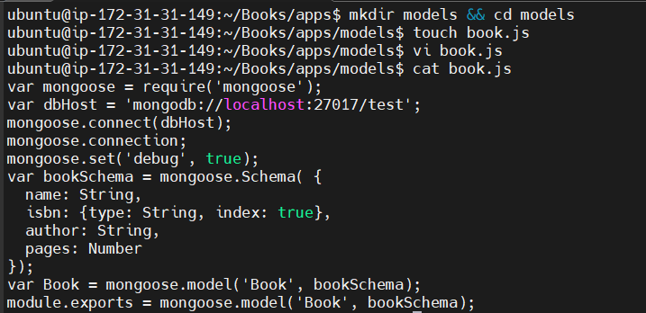

**accessing the routes with angularjs**

going back to books directory

` $ cd ../..`

creating the public directory

` $ mkdir public && cd public`

adding the script.js file

` $ vi script.js`

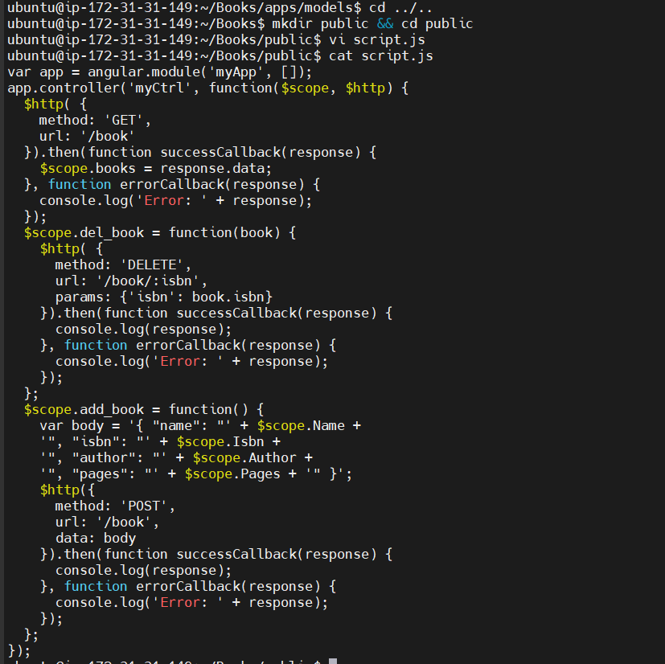

creating the index.html file in the public folder

` $ index.html`

going back to books directory

` $ cd ..`

starting the server with the following command:

` $ node server.js`

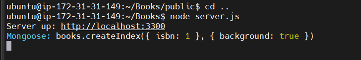

curl testing on a different virtual machine to see what the command returns

` $ curl -s http://localhost:3000`

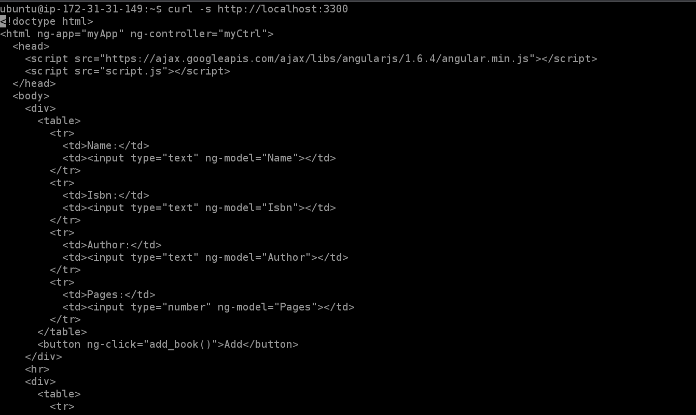

editing inbound rules to add tcp port 3300

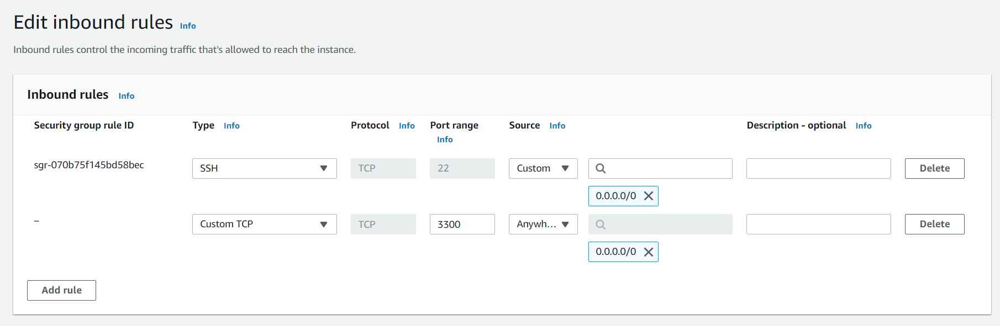

getting public ip address

` $ curl -s http://169.254.169.254/latest/meta-data/public-ipv4`

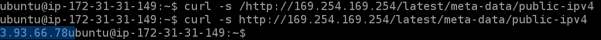

web book register application in the browser

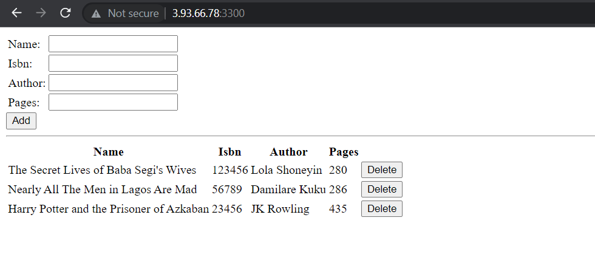

